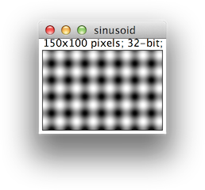
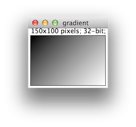
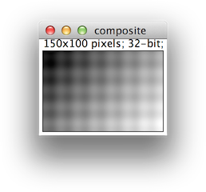

[](https://github.com/imagej/imagej-ops/actions/workflows/build-main.yml)
[](https://imagesc.zulipchat.com/#narrow/stream/327236-ImageJ2)

ImageJ Ops
==========

ImageJ Ops is an extensible Java framework for algorithms, particularly image
processing algorithms. Ops seeks to be a unifying library for scientific image
processing. See the
[Motivation](https://github.com/imagej/imagej-ops/wiki/Motivation) page for
details.

Getting started
---------------

Each op has a list of typed input and output parameters on which it operates.
You can think of an op as a (potentially multi-variable) function:
```
sum = math.add(a, b)
(phase, amplitude) = fft(image)
```

In many cases you can also pass a pre-allocated output which will be populated:
```
math.add(sum, a, b)
```

Some ops take other ops as inputs, which allows for things like "execute this
op on every pixel of that image":
```
add_op = op("math.add", 5)
output_image = map(input_image, add_op)
```

For more details, see the "Introduction to ImageJ Ops" tutorial notebook:

  https://imagej.github.io/tutorials

Working example
---------------

Try this Jython script in ImageJ's
[Script Editor](http://imagej.net/Script_Editor)!

```python
# @ImageJ ij

# create a new blank image
from jarray import array
dims = array([150, 100], 'l')
blank = ij.op().create().img(dims)

# fill in the image with a sinusoid using a formula
formula = "10 * (Math.cos(0.3*p[0]) + Math.sin(0.3*p[1]))"
sinusoid = ij.op().image().equation(blank, formula)

# add a constant value to an image
ij.op().math().add(sinusoid, 13.0)

# generate a gradient image using a formula
gradient = ij.op().image().equation(ij.op().create().img(dims), "p[0]+p[1]")

# add the two images
composite = ij.op().create().img(dims)
ij.op().math().add(composite, sinusoid, gradient)

# display the images
ij.ui().show("sinusoid", sinusoid)
ij.ui().show("gradient", gradient)
ij.ui().show("composite", composite)
```

The output:

  

How to contribute
-----------------

We welcome [pull requests](https://help.github.com/articles/using-pull-requests)!
* Use an
  [existing op](https://github.com/imagej/tutorials/tree/master/maven-projects/create-a-new-op)
  as a starting point
* Use [ImageJ code style](http://imagej.net/Coding_style)
* Use
  [small](https://crealytics.com/blog/5-reasons-keeping-git-commits-small/),
  [well-written](http://tbaggery.com/2008/04/19/a-note-about-git-commit-messages.html)
  commits
* Use a [topic branch](http://imagej.net/Git_topic_branches)
